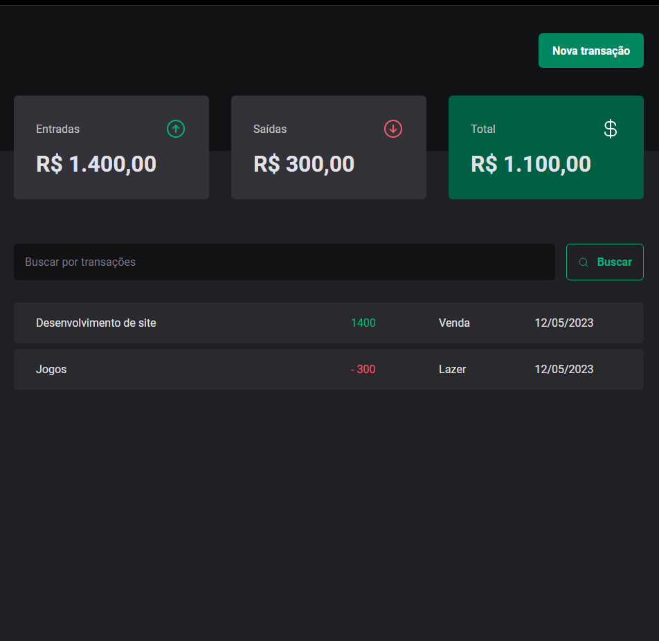
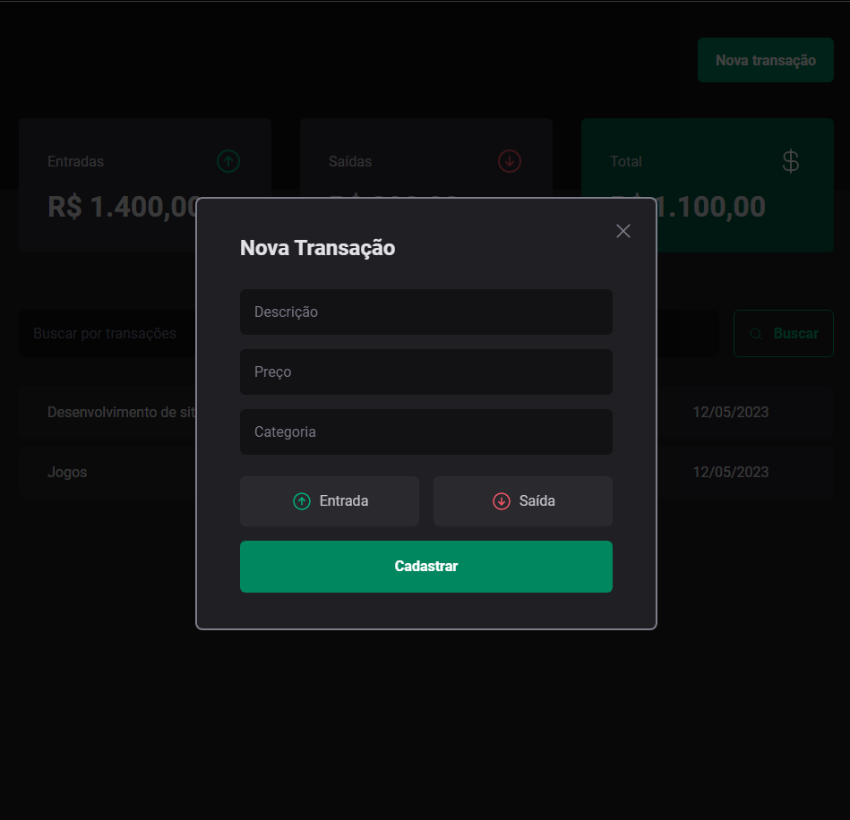

<h1 align="center">DTMoney API</h1>

### Aplicação desenvolvida no curso de especialização da Rocketseat

</br></br>

## Como executar a aplicação ⚙️

### Executar os seguintes comandos

``` js
  npm install
```

- Para instalar as dependências da aplicação

``` js
  npm run server
```

- Para iniciar o servidor

``` js
  npm run dev
```

- Para executar a aplicação
</br>
</br>

## O que foi desenvolvido 🚀

Aplicação onde você adiciona seus ganhos e gastos, e um painel mostra o seu saldo total.
<!-- 
<h3 align="center">Página inicial</h3>



</br></br></br></br></br>
<h3 align="center">Tela onde você adiciona um novo dado</h3>

<div align="center"></div>

</br></br> -->

## Como foi desenvolvido 📋

### Tecnologias utilizadas

- ReactJS
- Typescript
- Vite
- VsCode

- Radix
  > Utilizado para criar o modal de envio de novos dados
  </br>
https://www.radix-ui.com/

- Zod
    - npm install zod 
  > Utilizado para criar um schema dos dados do formulário
  </br>

- hookforms
  - npm install react-hook-form
  - npm i @hookform/resolvers </br>
  > Utilizado para validar as informações do schema criado pelo zod

- Contexts
 - npm i use-context-selector scheduler
 > Trabalhar com contextos separados


 - Important!!
 ``` npx tsc --noEmit ```

 > Mostrar no terminal os erros de typescript no código

